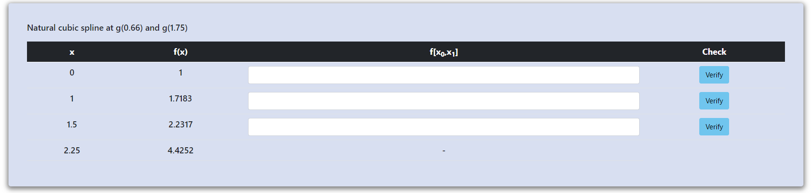
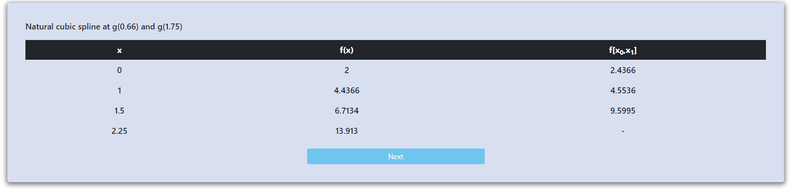
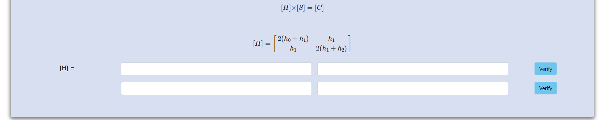
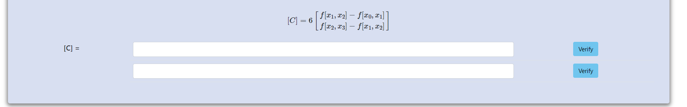
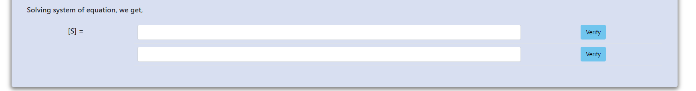
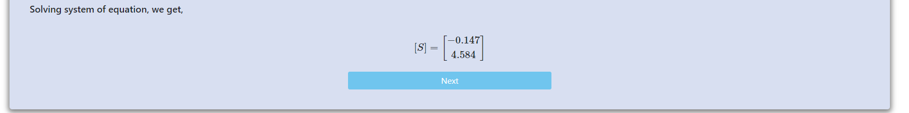
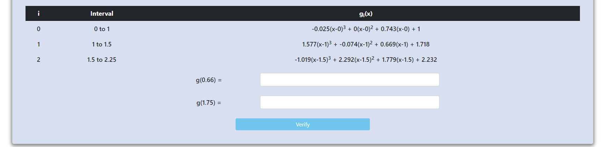

<h3><b>Step 1:</b> Click on "Next" </h3>

 
 

<h3><b>Step 2:</b> Fill the table </h3>

<h3>then click on "Verify" buttons</h3>

 
 

<h3><b>Step 3:</b> Click on "Next" </h3>

 
 

<h3><b>Step 4:</b> Calculate h0, h1 and h2 </h3>

<h3>then click on "Verify"</h3>

 
 

<h3><b>Step 5:</b> Click on "Next" </h3>

 
 

<h3><b>Step 6:</b> Calculate H matrix  </h3>

<h3>then click on "Verify" buttons</h3>

 
 

<h3><b>Step 7:</b> Click on "Next" </h3>

 
 

<h3><b>Step 8:</b> Calculate C matrix  </h3>

<h3>then click on "Verify" buttons</h3>

 
 

<h3><b>Step 9:</b> Click on "Next" </h3>

 
 

<h3><b>Step 10:</b> Calculate S matrix  </h3>

<h3>then click on "Verify" buttons</h3>

 
 

<h3><b>Step 11:</b> Click on "Next" </h3>

 
 

<h3><b>Step 12:</b> Calculate a, b, c & d for interval 0 to 1 </h3>

<h3>then click on "Verify"</h3>

 
 

<h3><b>Step 13:</b> Calculate a, b, c & d for interval 1 to 1.5 </h3>

<h3>then click on "Verify" </h3>
 
 

<h3><b>Step 14:</b> Calculate a, b, c & d for interval 1.5 to 2.25 </h3>

<h3>then click on "Verify" </h3>

 
 

<h3><b>Step 15 :</b> Click on "Next"  </h3>

 
 

<h3><b>Step 16 :</b> Calculate g(0.66) and g(1.75)  </h3>

<h3>then click on "Verify" </h3>

 
 

<h3><b>Step 17 :</b> Click on "Next"  </h3>

<h3>Experiment conmpleted</h3>