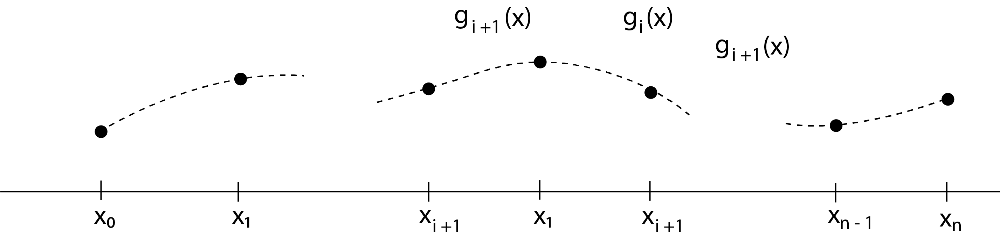

<h3>The Equation for a Cubic Spline</h3>

The drafting spline, from which the concept of spline curves is taken, bends according to the laws of beam flexure, so both the slope and curvature are everywhere continuous. Our mathematical spline curve must have this same behavior, requiring that they be of at least degree-3.

&emsp; We will create a succession of cubic splines over successive intervals of the data. (Tbere is no requirement that the points be evenly spaced.) Each spline must join with its neighboring cubic polynomials at the knots where they join with the same slope and curvature. (The end splines have only one neighbor, so their slope and curvature is not so constrained. This factor will be covered later.)

&emsp; We write the equation for a cubic polynomial, gi(x), in the ith interval, between points (xi, yi), (xi+1, yi+1). It looks like the solid curve shown here. The dashed curves are other cubic spline polynomials. It has this equation:

$$ g_i(x) = a_i(x-x_i)^3 +b_i(x-x_i)^2 + c_i(x-x_i) + d_i \qquad \qquad ...equ(1) $$

 

Thus, the cubic spline function we want is of the form

$$ 
g(x) = g_i(x) \ on \ the\ interval\ [x_i, x_{i+1}], \ for\ i=0,1,....,n-1
$$

and meets these conditions:

$$\begin{aligned}
   g_i(x_i) &= y_i, \qquad i=0,1,...,n-1 \ and \ g_{n-1}(x_n)= y_n; \qquad \qquad &...equ(2a) \\
   g_i(x_{i+1}) &= g_{i+1}(x_{i+1}), \qquad i=0,1,...,n-2; &...equ(2b) \\
   g_i^{'}(x_{i+1}) &= g_{i+1}^{'}(x_{i+1}), \qquad i=0,1,...,n-2; &...equ(2c) \\
   g_i^{''}(x_{i+1}) &= g_{i+1}^{''}(x_{i+1}), \qquad i=0,1,...,n-2; &...equ(2d) \\
\end{aligned}
$$

[Equation (2) says that the cubic spline fits to each of the points (2a), is continuous (2b), and is continuous in slope and curvature (2c) and (2d), throughout the region spanned by the points.]

&emsp; If there are n+1 points, the number of intervals and the number of gi(x)'s are n. Thus, there are four times n unknowns, which are the (ai, bi, ci, di) for i = 0, 1,... , n-1 Equation (2a) immediately gives

$$
   d_i = y_i, \qquad i=0,1,...,n-1 \qquad \qquad ...equ(3)
$$

Equation (2b) then gives

$$\begin{aligned}
   y_{i+1} = g_{i+1}(x_{i+1}) = g_i(x_{i+1}) &= a_i(x-x_{i+1})^3 + b_i(x-x_{i+1})^2 + c_i(x-x_{i+1}) + y_i \\
   &=a_ih_i^3 + b_ih_i^2 + c_ih_i + y_i, \qquad i=0,1,...,n-1 \qquad ...equ(4)
\end{aligned}
$$

[In the last part of Eq (4), we used hi = (xi+1 - xi), the width of the ith interval.]

 

To relate the slopes and curvatures of the joining splines, we difierentiate Eq. (1):

$$
\begin{aligned}
   g_i^{'}(x) &= 3a_i(x-x_i)^2 + 2b_i(x-x_i) + c_i, \qquad \qquad &...equ(5) \\
   g_i^{''}(x) &= 6a_i(x-x_i) + 2b_i, \quad for\ i=0,1,...,n-1. \qquad &...equ(6)
\end{aligned}
$$

Observe that the second derivative of a cubic is linear, so g"(x) is linear within [xi, xi+1].

The development is simplified if we write the equations in terms of the second derivative - that is, if we let Si =g"(xi) for i=0,1,...,n - 1 and Sn = g"n-1(xn).

From Eqs. (2d) and (6), we have

$$
\begin{aligned}
   S_i &= 6a_i(x_i - x_i) + 2b_i \\
   &= 2b_i \\
   S_{i+1} &= 6a_i(x_{i+1} - x_i) + 2b_i \\
   &= 6a_ih_i + 2b_i
\end{aligned}
$$

Hence we can write

$$
\begin{aligned}
   b_i &= \frac{S_i}{2}, \qquad \qquad &...equ(7) \\ \\
   a_i &= \frac{S_{i+1} - S_i}{6h_i} \qquad \qquad &...equ(8)
\end{aligned}
$$

We substitute the relations for ai, bi, di, given by Eqs. (3), (7) and (8) into Eq. (1) and then solve for ci :

$$
\begin{aligned}
   y_{i+1} &= \left(\frac{S_{i+1} - S_i}{6h_i}\right)h_i^3 + \frac{S_i}{2}h_i^2+c_ih_i+y_i \\ \\
   c_i &= \frac{y_{i+1} - y_i}{h_i} - \frac{2h_iS_i + h_iS_{i+1}}{6}
\end{aligned}
$$

&emsp; We now invoke the condition that the slopes of the two cubics that join at (xi, yi) are the same. For the equation in the ith interval, Eq. (2c) becomes, with x = xi,

$$
y_i^{'} = 3a_i(x_i - x_i)^2 + 2b_i(x_i - x_i) + c_i = c_i
$$

In the previous interval, from xi-1 to xi, the slope at its right end will be

$$
\begin{aligned}
   y_i^{'} &= 3a_{i-1}(x_i - x_{i-1})^2 + 2b_{i-1}(x_i - x_{i-1}) + c_{i-1} \\ 
   &= 3a_{i-1}h_{i-1}^2 + 2b_{i-1}h_{i-1} + c_{i-1}
\end{aligned}
$$

Equating these, and substituting for a, b, c, d their relationships in terms of S and y, we get

$$
\begin{aligned}
   y_i^{'} &= \frac{y_{i+1} - y_i}{h_i} - \frac{2h_iS_i + h_iS_{i+1}}{6} \\ \\ 
   &= 3\left(\frac{S_i - S_{i-1}}{6h_{i-1}}\right)h_{i-1}^2 + 2\left(\frac{S_{i-1}}{2}\right)h_{i-1} + \frac{y_i - y_{i-1}}{h_{i-1}} - \frac{2h_{i-1}S_{i-1} + h_{i-1}S_i}{6}
\end{aligned}
$$

Simplifying this equation, we get

$$
\boxed{
   \begin{aligned}
      h_{i-1}S_{i-1} + (2h_{i-1} + 2h_i)S_i + h_iS_{i+1} &=6\left(\frac{y_{i+1} - y_i}{h_i} - \frac{y_i - y_{i-1}}{h_{i-1}}\right) \\ \\
      &= 6(f[x_i,x_{i+1}] - f[x_{i-1}, x_i])
   \end{aligned}
} \qquad ...equ(9)
$$

The last part of Eq. (9) involves divided differences.

&emsp; Equation (9) applies at each internal point, from i = 1 to i = n - 1, there being n + 1 total points. This gives n - 1 equations relating the n + 1 values of Si . We get two additional equations involving S0 and Sn when we specify conditions pertaining to the end intervals of the whole curve. To some extent, these end conditions are arbitrary. Four* alternative choices are often used: Observe that the fourth end condition is "not a knot condition."

   <ol type="1">
   <li>
      Take S0 = 0 and Sn = 0. This makes the end cubics approach linearity at their extremities. This condition, called a <i>natural spline</i>, matches precisely to the drafting device. This technique is used very frequently.
   </li>
   <li>
      Another often used condition is to force the slopes at each end to assume specified values. When that information is not known, the slope might be estimated from the points. If f'(x0) = A and f'(xn) = B, we use these relations (note that divided differences are employed):
   
      $$
         \begin{aligned}
            &\text{At left end:} \quad 2h_0S_0 + h_0S_1 = 6(f[x_0, x_1] - A). \\
            &\text{At right end:} \quad h_{n-1}S_{n-1}+2h_{n-1}S_n = 6(B-f[x_{n-1},x_n]).
         \end{aligned}
      $$
   
   </li>
   <li>
      Take S0= S1, Sn = Sn-1. This is equivalent to assuming that the end cubics approach parabolas at their extremities.
   </li>
   <li>
      Take S0 as a linear extrapolation from S1 and S2, and Sn, as a linear extrapolation from Sn-1 and Sn-2. Only this condition gives cubic spline curves that match exactly to f(x) when f(x) is itself a cubic. For condition 4, we use these relations:

      $$
         \begin{gathered}
            \text{At left end :}&\quad \frac{S_1 - S_0}{h_0} = \frac{S_2-S_1}{h_1}, \quad S_0 = \frac{(h_0 + h_1)S_1 - h_0S_2}{h_1} \\ \\ 

            \text{At right end :} &\quad \frac{S_n - S_{n-1}}{h_{n-1}} = \frac{S_{n-1} - S_{n-2}}{h_{n-2}}, \qquad \qquad ...equ(10) \\ \\

            &S_n = \frac{(h_{n-2} + h_{n-1})S_{n-1} - h_{n-1}S_{n-2}}{h_{n-2}}.
         \end{gathered}
      $$

      
This is called "not a knot condition."

   </li>
   </ol>

 

&emsp; Relation 1, where S0 = 0 and Sn = 0, is called a <i>natural spline</i>. It is often felt that this flattens the curve too much at the ends; in spite of this, it is frequently used, Relation 4 frequently suffers from the other extreme, giving too much curvature in the end intervals. Probably the best end condition to use is condition 2, provided reasonable estimates of the derivative are available.

&emsp; If we write the equation of S1, S2,..., Sn-1 [Eq. (9)] in matrix form, we get

$$
\begin{aligned}
   &\begin{bmatrix}
   & & & & & & \\ 
   h_0 & 2(h_0+h_1) & h_1 & & & & \\
   & h_1 & 2(h_1 + h_2) & h_2 & &  & \\
   & & h_2 & 2(h_2+h_3) & h_3 & & \\
   & & & & ⋱ & & \\ 
   & & & & h_{n-2} & 2(h_{n-2} + h_{n-1}) & h_{n-1} \\
   & & & & & & 
\end{bmatrix}
\begin{bmatrix}
   S_0 \\ S_1 \\ S_2 \\ S_3 \\ ⋮ \\ S_{n-1} \\ S_n
\end{bmatrix} \\ \\ &= 6\begin{bmatrix}
   f[x_1, x_2] - f[x_0,x_1] \\
   f[x_2, x_3] - f[x_1,x_2] \\
   f[x_3, x_4] - f[x_2,x_3] \\
   ⋮ \\
   f[x_{n-1}, x_n] - f[x_{n-2},x_{n-1}]

\end{bmatrix}
\end{aligned}
$$

&emsp; In this matrix array there are only n - 1 equations, but n + 1 unknowns. We can eliminate two unknowns (S0 and Sn) using the relations that correspond to the end-condition assumptions. In the first three cases, this reduces the S vector to n - 1 elements, and the coefficient matrix becomes square, of size (n - 1 &times; n - 1). Furthermore, the matrix is always tridiagonal (even in case 4), and hence is solved speedily and can be stored economically.

&emsp; For each end condition, the coefficient matrices become

Condition 1 &emsp; S0 = 0, Sn = 0 :

$$
\begin{bmatrix}
   2(h_0 + h_1) & h_1 & & & \\
   h_1 & 2(h_1 + h_2) & h_2 &  & \\
   & h_2 & 2(h_2 + h_3) & h_3 & \\
   & & ⋱ &  & \\
   & & & h_{n-2} & 2(h_{n-2} + h_{n-1})
\end{bmatrix}
$$

 

Condition 2 &emsp; f'(x0) = A and f'(xn) = B :

$$
\begin{bmatrix}
   2h_0 & h_0 & & & \\
   h_0 & 2(h_0 + h_1) & h_1 & & \\
   & h_1 & 2(h_1 + h_2) & h_2 & \\
   & & ⋱ & & \\
   & & & h_{n-1} & 2h_{n-1}
\end{bmatrix}
$$

 

Condition 3 &emsp; S0 = S1, Sn = Sn-1 :

$$
\begin{bmatrix}
   (3h_0+2h_1) & h_1 & & & \\
   h_1 & 2(h_1 + h_2) & h_2 & & \\
   & h_2 & 2(h_2 + h_3) & h_3 & \\
   & & ⋱ & & \\
   & & & h_{n-2} & (2h_{n-2} + 3h_{n-1})
\end{bmatrix}
$$

 

Condition 4 &emsp; S0 and Sn are linear extrapolations :

$$
\begin{bmatrix}
   \frac{(h_0 + h_1)(h_0+2h_1)}{h_1} & \frac{h_1^2 - h_0^2}{h_1} & & & \\
   h_1 & 2(h_1 + h_2) & h_2 & & \\
   & h_2 & 2(h_2+h_3) & h_3 & \\
   & & \ddots & & \\
   & & & \frac{h_{n-2}^2 - h_{n-1}^2}{h_{n-2}} & \frac{(h_{n-1} + h_{n-1})(h_{n-1} + 2h_{n-2})}{h_{n-2}}
\end{bmatrix}
$$

&emsp; With condition after 4, solving the set of equations, we must compute S0 and Sn using Eq. (10). For conditions 1, 2, and 3, no computations are needed. For each of the first three cases, the right-hand-side vector is the same; it is given in Eq. (9). If the data are evenly spaced, the matrices reduce to a simple form.

&emsp; After the Si values are obtained, we get the coefficients ai, bi, ci, and di, for the cubics in each interval. From these we can compute points on the interpolating curve.

$$
\begin{aligned}
   &a_i = \frac{S_{i+1} - S_i}{6h_i} \\ \\
   &b_i = \frac{S_i}{2} \\ \\ 
   &c_i = \frac{y_{i+1} - y_i}{h_i} - \frac{2h_iS_i + h_iS_{i+1}}{6} \\ \\
   &d_i = y_i
\end{aligned}
$$

   